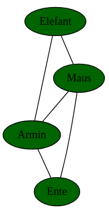
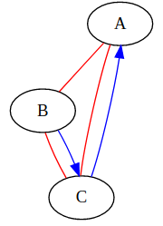

# D3.js (v6) Cheatsheet

## Elemente auswählen

- `d3.select(cssSelector: string)` - Einzelnes Element auswählen
- `d3.selectAll(cssSelector: string)` - Mehrere Elemente auswählen

## Elemente erzeugen

- `<selection>.append(tagName: string)` - Element innerhalb der Selection als letztes Element einfügen
- `<selection>.data(data: any[]).enter().append(tagName: string)` - Für alle Items des data-Arrays ein Element innerhalb der Selection anhängen
- `<selection>.insert(tagName: string, ':first-child')` - Element innerhalb der Selection als erstes Element einfügen

## Elemente anpassen

- `.attr(name: string, value: any)` - Generisches Attribut, siehe auch SVG Attribute
- `.style(cssStyleProperty: string, value: string)` - Inline CSS (für jede Eigenschaft einzeln aufrufen)
- `.text(value: string)` - Text innerhalb des Elements

## SVG Tags

- `g` - Gruppe, z. B. zum transformieren mehrerer Elemente
- `path` - Pfade (Formen) jeglicher Art, auch Linien
- `rect` - Rechtecke/Quadrate
- `circle` - Kreise
- `ellipse` - Ellipsen
- `text` - Text

## SVG Attribute

### Allgemein

- `x` und `y` - X-Koordinate bzw. Y-Koordinate (SVG Koordinatensystem beginnt oben links, d. h. Y von oben nach unten)
- `width` und `height` - Breite bzw. Höhe
- `transform` - Transformationen (Kombination möglich)
    - `translate(x, y)` - Verschieben
    - `rotate(angle)` - Rotieren
- `fill` - Füllfarbe (hex, rgb, HTML colors), 'none' für Entfernen
- `stroke` - Rahmenfarbe (hex, rgb, HTML colors), 'none' für Entfernen
- `text-anchor` - horizontale Textausrichtung; `start`, `middle` oder `end`

### `path`

- `d` - Daten des Pfads (nur an `path`-Elementen verwenden)

### `circle` / `ellipse`

- `r`  bzw. `rx` und `ry` bei Ellipsen - Radius
- `cx` und `cy` - X bzw. Y Koordinate des Mittelpunkts


<div class="page"/>

## Zeiten / Daten

```js
// jetzt
const now = new Date()
// Parsen eines best. Zeitformats, z. B. `%X`
d3.timeParse(format: string)
// Formatieren eines Date-Objektes, z. B. `new Date()`                    
d3.timeFormat(format: string)(date: Date)
```

### Manipulieren (Offset)
```js
d3.<interval>.offset(value: number) // value negativ oder positiv
```
Mögliche `interval`-Werte: `timeMillisecond`, `timeSecond`, `timeMinute`, `timeHour`, `timeDay`, `timeWeek` (Wochenbeginn: Sonntag), `timeMonday` (Wochenbeginn: Montag), `timeMonth` und `timeYear`


### Mögliche `format`-Identifier
- `%a` - abbreviated weekday name.
- `%A` - full weekday name.
- `%b` - abbreviated month name.
- `%B` - full month name.
- `%c` - the locale’s date and time, such as `%x, %X`.
- **`%d` - zero-padded day of the month as a decimal number [01,31].**
- `%e` - space-padded day of the month as a decimal number [ 1,31]; equivalent to `%_d`.
- `%f` - microseconds as a decimal number [000000, 999999].
- `%g` - ISO 8601 week-based year without century as a decimal number [00,99].
- `%G` - ISO 8601 week-based year with century as a decimal number.
- **`%H` - hour (24-hour clock) as a decimal number [00,23].**
- `%I` - hour (12-hour clock) as a decimal number [01,12].
- `%j` - day of the year as a decimal number [001,366].
- **`%m` - month as a decimal number [01,12].**
- **`%M` - minute as a decimal number [00,59].**
- `%L` - milliseconds as a decimal number [000, 999].
- `%p` - either AM or PM.
- `%q` - quarter of the year as a decimal number [1,4].
- `%Q` - milliseconds since UNIX epoch.
- `%s` - seconds since UNIX epoch.
- `%S` - second as a decimal number [00,61].
- `%u` - Monday-based (ISO 8601) weekday as a decimal number [1,7].
- `%U` - Sunday-based week of the year as a decimal number [00,53].
- `%V` - ISO 8601 week of the year as a decimal number [01, 53].
- `%w` - Sunday-based weekday as a decimal number [0,6].
- `%W` - Monday-based week of the year as a decimal number [00,53].
- `%x` - the locale’s date, such as `%-m/%-d/%Y`.
- **`%X` - the locale’s time, such as `%-I:%M:%S %p`.**
- `%y` - year without century as a decimal number [00,99].
- **`%Y` - year with century as a decimal number, such as `1999`.**
- `%Z` - time zone offset, such as `-0700`, `-07:00`, `-07`, or `Z`.
- `%%` - a literal percent sign (`%`).


### 

<div class="page"/>

## Beispiele

### SVG mit inneren Abständen

```js
const padding = { top: 30, bottom: 30, left: 30, right: 30 }
const width = 600, height = 400
// innere Breite, für scale-Funktionen etc. verwenden
const innerWidth = width - padding.left - padding.right
// innere Höhe, für scale-Funktionen etc. verwenden
const innerHeight = height - padding.top - padding.bottom

const svg = d3.select('#foobar').append('svg').attr('width', width).attr('height', height)
		// Optional: Hintergrundfarbe
		.style('background', '#f0f0f0')
        // Optional: Gruppe, damit innere Elemente nicht verschoben werden müssen
        .append('g').attr('transform', `translate(${padding.left}, ${padding.top})`)
```

### Balkendiagramm horizontal

```js
const data = [{country: 'France', value: 123}, /*...*/]
const x = d3.scaleLinear().domain([0, 13000]).range([0, innerWidth])
const y = d3.scaleBand().domain(data.map(d => d.country)).range([0, innerHeight]).padding(.1)
// bars
svg.selectAll().data(data).enter().append('rect')
    .attr('x', x(0)).attr('y', d => y(d.country))
    .attr('width', d => x(d.value)).attr('height', y.bandwidth())
    .attr('fill', 'lightblue')
// x axis
svg.append('g')
    .attr('transform', `translate(0, ${innerHeight})`)
    .call(d3.axisBottom(x))
    // Optional: Bei langen Kategorienamen
    .selectAll('text').attr('text-anchor', 'end').attr('transform', `translate(-10, 0) rotate(-45)`)
// y axis
svg.append('g').call(d3.axisLeft(y))
```

### Balkendiagramm vertikal

```js
const data = [{country: 'France', value: 123}, /*...*/]
const x = d3.scaleBand().domain(data.map(d => d.country)).range([0, innerWidth]).padding(.1)
const y = d3.scaleLinear().domain([0, 13000]).range([innerHeight, 0])
// bars
svg2.selectAll().data(data).enter().append('rect')
        .attr('x', d => x(d.country)).attr('y', d => y(d.value))
        .attr('width', x.bandwidth()).attr('height', d => y(0) - y(d.value))
        .attr('fill', 'lightblue')
// x axis
svg2.append('g')
    .attr('transform', `translate(0, ${innerHeight})`)
    .call(d3.axisBottom(x))
    // Optional: Bei langen Kategorienamen
    .selectAll('text').attr('text-anchor', 'end').attr('transform', 'translate(-10, 0) rotate(-45)')
// y axis
svg2.append('g').call(d3.axisLeft(y))
```

<div class="page"></div>

### Mathematische Funktionen
- x- und y-Achsen im Koordinatenursprung
- getestet mit `x³-3x²-x+3`, `x²`, `cos(x)`
```js
const f = x => (Math.pow(x, 3) - (3 * Math.pow(x, 2)) - x + 3) // x³-3x²-x+3
const step = 0.05;
// x- und y-Bereich anpassen!
const xInterval = [-2, 4], yInterval = [-15, 15)]
const data = d3.range(xInterval[0], xInterval[1] + step, step).map(f) // Funktionswerte ausrechnen

const x = d3.scaleLinear().domain(xInterval).range([0, innerWidth]).nice()
const y = d3.scaleLinear().domain(yInterval).range([innerHeight, 0]).nice()
const line = d3.line().x((d, i) => x(i * step) - x(0)).y(d => y(d))

const graph = svg.append('g').attr('transform', `translate(${padding.left}, ${padding.top})`)
// x axis
graph.append('g')
        .attr('transform', `translate(0, ${y(0)})`)
        .call(d3.axisBottom(x))
// y axis
graph.append('g')
        .attr('transform', `translate(${x(0)}, 0)`)
        .call(d3.axisLeft(y))
// curve
graph.append('path').data([data])
        .attr('d', line).style('fill', 'none').style('stroke', 'darkblue')
```

<div class="page"/>

### Graphen mit Graphviz

#### Ungerichtet

<div class="row">
<div class="column s8">
<pre>
d3.select('#foobar').graphviz().renderDot(`
    graph {
        node [style="filled" fillcolor=darkgreen]
        Elefant -- {Maus, Armin} 
        Maus -- {Armin, Ente}
        Armin -- Ente
    }
`)
</pre>
</div>
<div class="column s4">

</div>
</div>

#### Gerichtet + Ungerichtet mit Subgraphen

<div class="row">
<div class="column s8">
<pre>
d3.select('#foobar').graphviz().renderDot(`
    digraph {
        A; B; C;
        subgraph {
            edge [dir=none, color=red]
            A -> B -> C -> A
        }
        subgraph {
            edge [color=blue]
            B -> C
            C -> A
        }
    }
`)
</pre>
</div>
<div class="column s4">
    
</div>
</div>