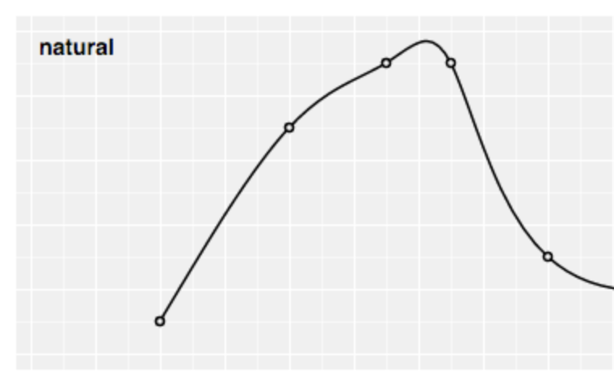

# D3.js (v6) Cheatsheet

## Basics
### Elemente auswählen

- `d3.select(cssSelector: string)` - Einzelnes Element auswählen
- `d3.selectAll(cssSelector: string)` - Mehrere Elemente auswählen

### Elemente erzeugen

- `<selection>.append(tagName: string)` - Element innerhalb der Selection als letztes Element einfügen
- `<selection>.data(data: any[]).enter().append(tagName: string)` - Für alle Items des data-Arrays ein Element innerhalb der Selection anhängen
- `<selection>.insert(tagName: string, ':first-child')` - Element innerhalb der Selection als erstes Element einfügen

### Elemente anpassen

- `.attr(name: string, value: any)` - Generisches Attribut, siehe auch SVG Attribute
- `.style(cssStyleProperty: string, value: string)` - Inline CSS (für jede Eigenschaft einzeln aufrufen)
- `.text(value: string)` - Text innerhalb des Elements

### Quickmath
- `d3.min(number[]): number` - Minimum
- `d3.max(number[]): number` - Maximum
- `d3.extent(number[]): number[]` - Minimum und Maximum
- `Math.PI` - Pi-Konstante
- `Math.pow(base: number, exponent: number)` - Exponieren
- `Math.sin(x: number)`, `Math.cos(x: number)` - Sinus, Kosinus 

### Achsen & Skalierung
#### Ordinal
- `d3.scaleOrdinal()` - Ordinale Skalierung, Domain und Range müssen diskrete (alle) Werte im Array übergeben bekommen, liefert diskrete Werte zurück
- `d3.scaleBand()` - Ordinale Skalierung, liefert jedoch kontinuierliche Werte 
  - `.padding(value: number)` - Padding zwischen den Balken

#### Kontinuierlich
- `d3.scaleLinear()` - Lineare Skalierung
- `d3.scalePow()` - Exponentiale Skalierung
  - `.exponent(value: number)` - Exponent
- `d3.scaleSqrt()` = `d3.scalePow().exponent(0.5)`
- `d3.scaleLog()` - Logarithmische Skalierung
  - `.base(value: number)` - default ist 10
- `d3.scaleTime()` - Zeitskalierung (als Domain Start- und Enddatum)
- `d3.scaleSequential(interpolator: function)` - interpolator: z. B. `d3.interpolateRainbow` 

#### Domain, Range
- `<scale>.domain([start, end])` - Welche Werte sollen dargestellt werden?
- `<scale>.range([start, end])` - Wie sollen die Werte dargestellt werden - z.B. als Koordinaten-Range im SVG

<div class="page"/>

### Farben
#### Kategorien
- `d3.schemeCategory10` - Array mit 10 verschiedenen Farben, gut für Torten

#### Einfarbig
- `d3.interpolateBlues(t)`, `d3.interpolateGreens(t)`, `d3.interpolateReds(t)` - t zwischen 0 und 1 (kontinuierlich)
- `d3.schemeBlues[k]`, `d3.schemeGreens[k]`, `d3.schemeReds[k]` - k zwischen 3 und 11 (ordinal)

#### Regenbogen
- `d3.interpolateRainbow(t)` - t zwischen 0 und 1 (kontinuierlich)

### Symbole
- `.append('path').attr('d', d3.symbol(type, size))` - Symbol `type` (default=circle, Typen s. u.) mit `size` (default=64) erzeugen
- Symboltypen: `d3.symbolCircle`, `d3.symbolCross`, `d3.symbolDiamond`, `d3.symbolSquare`, `d3.symbolStar`, `d3.symbolTriangle`

### Glättung / Curve-Arten
- `.curve(<curveType>)` - Glättung der Kurve
- `<curveType>`, z. B. für `stepBefore` → `d3.curveStepBefore` :
<div class="row">
    <div class="column s4">
        
    </div>
     <div class="column s4">
        
    </div>
    <div class="column s4">
        
    </div>
</div>
<div class="row">
    <div class="column s4">
        
    </div>
     <div class="column s4">
        
    </div>
    <div class="column s4">
        
    </div>
</div>


### Mausinteraktion
- `<selection>.on(eventName: string, listener: function)` - Event listener für bestimmtes Event festlegen
  - Events:
    - `mouseover`, `mouseout` - Betreten/Verlassen des Elements selbst
    - `mouseenter`, `mouseleave` - Betreten/Verlassen des Element und aller Kindelemente (wird nur einmal abgefeuert)
    - `mousemove` - Bewegen der Maus über Element
    - `click` - Klick
    - `mousedown`, `mouseup` - Drücken bzw. Loslassen der Maustaste
  - listener: Erstes Argument ist vom Typ `MouseEvent`
- `<selection>.classed(name: string, value: boolean)` - Hinzufügen / Entfernen von CSS Klassen
- `d3.pointer(MouseEvent): number[2]` - Gibt X und Y Koordinaten des `MouseEvent` zurück

<div class="page"/>

## SVG
### Tags

- `g` - Gruppe, z. B. zum transformieren mehrerer Elemente
- `path` - Pfade (Formen) jeglicher Art, auch Linien
- `rect` - Rechtecke/Quadrate
- `circle` - Kreise
- `ellipse` - Ellipsen
- `text` - Text

### Attribute für die Tags

#### Für alle

- `x` und `y` - X-Koordinate bzw. Y-Koordinate (SVG Koordinatensystem beginnt oben links, d. h. Y von oben nach unten)
- `width` und `height` - Breite bzw. Höhe
- `transform` - Transformationen (Kombination möglich)
    - `translate(x, y)` - Verschieben
    - `rotate(angle)` - Rotieren
- `fill` - Füllfarbe (hex, rgb, HTML colors), 'none' für Entfernen
- `stroke` - Rahmenfarbe (hex, rgb, HTML colors), 'none' für Entfernen

#### Für `text`
- `text-anchor` - horizontale Textausrichtung; `start`, `middle` oder `end`
- `aligment-baseline` - vertikale Textausrichtung; `hanging` (obere Kante), `central` (mittig), `baseline` (untere Kante)

#### Für `path`

- `d` - Daten des Pfads (nur an `path`-Elementen verwenden)

#### Für `circle` / `ellipse`

- `r`  bzw. `rx` und `ry` bei Ellipsen - Radius
- `cx` und `cy` - X bzw. Y Koordinate des Mittelpunkts


<div class="page"/>

## Daten importieren
### CSV (Comma seperated values) / TSV (Tab seperated values)
- `d3.csv(url: string): Promise<DSVRowArray>` für CSV
- `d3.tsv(url: string): Promise<DSVRowArray>` für TSV
- Alle Daten werden als Strings eingelesen!

```csv
sex,weight,bmi
"M",93,25.57
"F",68,20.10
"M",59,17.40
```

```js
d3.csv('example.csv').then(data => {
    const parsedData = data.map(item => {
        item.weight = parseInt(item.weight) // Parsen von Integern
        item.bmi = parseFloat(item.bmi) // Parsen von Floats
        return item
    })
    // do something
})
```

### JSON
- `d3.json(url: string): Promise<any>`
- Daten werden im gleichen Format wie im JSON eingelesen

```js
d3.json('example.json').then(data => {
    // do something
})
```

### XML
```xml
<?xml version="1.0" encoding="UTF-8" ?>
<root>
    <data>
        <sex>M</sex>
        <weight>93</weight>
        <bmi>25.57</bmi>
    </data>
    <!-- ... -->
</root>
```
```js
d3.xml('example.xml').then(data => {
    const xmlString = new XMLSerializer().serializeToString(data)
    const x2js = new X2JS()
    const parsedData = x2js.xml2js(xmlString).root.data
    // do something
})
```

<div class="page"/>

## Zeiten

```js
// jetzt
const now = new Date()
// Parsen eines best. Zeitformats, z. B. `%X`
d3.timeParse(format: string)
// Formatieren eines Date-Objektes, z. B. `new Date()`                    
d3.timeFormat(format: string)(date: Date)
```

### Manipulieren (Offset)
```js
d3.<interval>.offset(value: number) // value negativ oder positiv
```
Mögliche `interval`-Werte: `timeMillisecond`, `timeSecond`, `timeMinute`, `timeHour`, `timeDay`, `timeWeek` (Wochenbeginn: Sonntag), `timeMonday` (Wochenbeginn: Montag), `timeMonth` und `timeYear`


### Mögliche `format`-Identifier
- `%a` - abbreviated weekday name.
- `%A` - full weekday name.
- `%b` - abbreviated month name.
- `%B` - full month name.
- `%c` - the locale’s date and time, such as `%x, %X`.
- **`%d` - zero-padded day of the month as a decimal number [01,31].**
- `%e` - space-padded day of the month as a decimal number [ 1,31]; equivalent to `%_d`.
- `%f` - microseconds as a decimal number [000000, 999999].
- `%g` - ISO 8601 week-based year without century as a decimal number [00,99].
- `%G` - ISO 8601 week-based year with century as a decimal number.
- **`%H` - hour (24-hour clock) as a decimal number [00,23].**
- `%I` - hour (12-hour clock) as a decimal number [01,12].
- `%j` - day of the year as a decimal number [001,366].
- **`%m` - month as a decimal number [01,12].**
- **`%M` - minute as a decimal number [00,59].**
- `%L` - milliseconds as a decimal number [000, 999].
- `%p` - either AM or PM.
- `%q` - quarter of the year as a decimal number [1,4].
- `%Q` - milliseconds since UNIX epoch.
- `%s` - seconds since UNIX epoch.
- `%S` - second as a decimal number [00,61].
- `%u` - Monday-based (ISO 8601) weekday as a decimal number [1,7].
- `%U` - Sunday-based week of the year as a decimal number [00,53].
- `%V` - ISO 8601 week of the year as a decimal number [01, 53].
- `%w` - Sunday-based weekday as a decimal number [0,6].
- `%W` - Monday-based week of the year as a decimal number [00,53].
- `%x` - the locale’s date, such as `%-m/%-d/%Y`.
- **`%X` - the locale’s time, such as `%-I:%M:%S %p`.**
- `%y` - year without century as a decimal number [00,99].
- **`%Y` - year with century as a decimal number, such as `1999`.**
- `%Z` - time zone offset, such as `-0700`, `-07:00`, `-07`, or `Z`.
- `%%` - a literal percent sign (`%`).


### 

<div class="page"/>

## Beispiele

### Grundlage für Alles: SVG mit inneren Abständen

```js
const padding = { top: 30, bottom: 30, left: 30, right: 30 }
const width = 600, height = 400
// innere Breite, für scale-Funktionen etc. verwenden
const innerWidth = width - padding.left - padding.right
// innere Höhe, für scale-Funktionen etc. verwenden
const innerHeight = height - padding.top - padding.bottom

const svg = d3.select('#foobar').append('svg').attr('width', width).attr('height', height)
		// Optional: Hintergrundfarbe
		.style('background', '#f0f0f0')
        // Optional: Gruppe, damit innere Elemente nicht verschoben werden müssen
        .append('g').attr('transform', `translate(${padding.left}, ${padding.top})`)
```

### Balkendiagramm horizontal

```js
const data = [{country: 'France', value: 123}, /*...*/]
const x = d3.scaleLinear().domain([0, 13000]).range([0, innerWidth])
const y = d3.scaleBand().domain(data.map(d => d.country)).range([0, innerHeight]).padding(.1)
// bars
svg.selectAll().data(data).enter().append('rect')
    .attr('x', x(0)).attr('y', d => y(d.country))
    .attr('width', d => x(d.value)).attr('height', y.bandwidth())
    .attr('fill', 'lightblue')
// x axis
svg.append('g')
    .attr('transform', `translate(0, ${innerHeight})`)
    .call(d3.axisBottom(x))
    // Optional: Bei langen Kategorienamen
    .selectAll('text').attr('text-anchor', 'end').attr('transform', `translate(-10, 0) rotate(-45)`)
// y axis
svg.append('g').call(d3.axisLeft(y))
```

### Balkendiagramm vertikal

```js
const data = [{country: 'France', value: 123}, /*...*/]
const x = d3.scaleBand().domain(data.map(d => d.country)).range([0, innerWidth]).padding(.1)
const y = d3.scaleLinear().domain([0, 13000]).range([innerHeight, 0])
// bars
svg2.selectAll().data(data).enter().append('rect')
        .attr('x', d => x(d.country)).attr('y', d => y(d.value))
        .attr('width', x.bandwidth()).attr('height', d => y(0) - y(d.value))
        .attr('fill', 'lightblue')
// x axis
svg2.append('g')
    .attr('transform', `translate(0, ${innerHeight})`)
    .call(d3.axisBottom(x))
    // Optional: Bei langen Kategorienamen
    .selectAll('text').attr('text-anchor', 'end').attr('transform', 'translate(-10, 0) rotate(-45)')
// y axis
svg2.append('g').call(d3.axisLeft(y))
```

<div class="page"></div>

### Tortendiagramm
- Äußerer Durchmesser wird automatisch festgelegt
```js
const data = [{ name: 'Jim', votes: 12 }, /* ... */]
// zentrieren
const group = svg.append('g').attr('transform', `translate(${innerWidth / 2}, ${innerHeight / 2})`)
const radius = Math.min(innerHeight, innerWidth) / 2
const pie = d3.pie().value(d => d.votes).padAngle(.025)(data)
const colors = d3.scaleOrdinal().domain(pie.map(d => d.index)).range(d3.schemeCategory10)
const arc = d3.arc().innerRadius(30).outerRadius(radius).cornerRadius(4)
// Tortenstücke
group.selectAll().data(pie).enter().append('path').attr('d', arc).attr('fill', d => colors(d.index))
// weiße Beschriftung innerhalb der Tortenstücke
group.selectAll().data(pie).enter().append('text').text(d => d.data.name)
    .attr('x', d => arc.innerRadius(radius - 60).centroid(d)[0])
    .attr('y', d => arc.innerRadius(radius - 60).centroid(d)[1])
    .attr('font-family', 'sans-serif').attr('font-size', 11)
    .attr('text-anchor', 'middle')
    .attr('fill', 'white')
```

### Legende (Fortsetzung Tortendiagramm)
- `padding.left` entsprechend anpassen
```js
const legendSize = 20
const legend = svg.append('g').selectAll().data(pie).enter()
legend.append('rect')
    .attr('x', -padding.left + 20).attr('y', (d, i) => i * (legendSize + 5))
    .attr('width', legendSize).attr('height', legendSize)
    .style('fill', d => colors(d.index))

legend.append('text').text(d => d.data.name)
    .attr('x', -padding.left + 20 + legendSize * 1.2)
    .attr('y', (d, i) => (i * (legendSize + 5) + legendSize / 2))
    .attr('alignment-baseline', 'central')
    .style('font-family', 'sans-serif').style('font-size', 14)
```

<div class="page"/>

### Mathematische Funktionen und Grid
- x- und y-Achsen im Koordinatenursprung, y-Wertebereich wird anhand der Daten automatisch berechnet
- getestet mit `x³-3x²-x+3`, `x²`, `cos(x)`
```js
const f = x => (Math.pow(x, 3) - (3 * Math.pow(x, 2)) - x + 3) // x³-3x²-x+3
const step = 0.05;
// Bereich anpassen!
const xInterval = [-2, 4]
const data = d3.range(xInterval[0], xInterval[1] + step, step).map(f) // Funktionswerte ausrechnen
const yInterval = d3.extent(data)

const x = d3.scaleLinear().domain(xInterval).range([0, innerWidth]).nice()
const y = d3.scaleLinear().domain(yInterval).range([innerHeight, 0]).nice()
const line = d3.line().x((d, i) => x(i * step) - x(0)).y(d => y(d))

const graph = svg.append('g').attr('transform', `translate(${padding.left}, ${padding.top})`)

// Optional: Grid hinzufügen
graph.append('g').call(d3.axisBottom(x).tickSize(innerHeight).tickFormat(''))
graph.append('g').call(d3.axisLeft(y).tickSize(-innerWidth).tickFormat(''))
graph.selectAll('.tick')
    .attr('opacity', .2)
    // gestrichelt
    .attr('stroke-dasharray', '2,2')
graph.selectAll('.domain').attr('display', 'none')

// x axis
graph.append('g')
        .attr('transform', `translate(0, ${y(0)})`)
        .call(d3.axisBottom(x))
// y axis
graph.append('g')
        .attr('transform', `translate(${x(0)}, 0)`)
        .call(d3.axisLeft(y))
// curve
graph.append('path').data([data])
        .attr('d', line).style('fill', 'none').style('stroke', 'darkblue')
```

<div class="page"/>

## Graphen mit Graphviz

### Ungerichtet

<div class="row">
<div class="column s8">
<pre>
d3.select('#foobar').graphviz().renderDot(`
    graph {
        node [style="filled" fillcolor=darkgreen]
        Elefant -- {Maus, Armin} 
        Maus -- {Armin, Ente}
        Armin -- Ente
    }
`)
</pre>
</div>
<div class="column s4">

</div>
</div>

### Gerichtet + Ungerichtet mit Subgraphen

<div class="row">
<div class="column s8">
<pre>
d3.select('#foobar').graphviz().renderDot(`
    digraph {
        A; B; C;
        subgraph {
            edge [dir=none, color=red]
            A -> B -> C -> A
        }
        subgraph {
            edge [color=blue]
            B -> C
            C -> A
        }
    }
`)
</pre>
</div>
<div class="column s4">
    
</div>
</div>